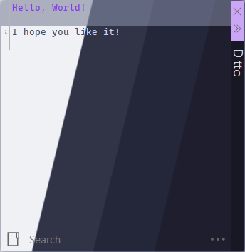
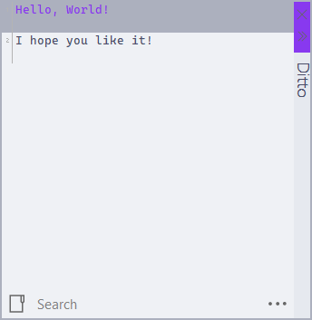
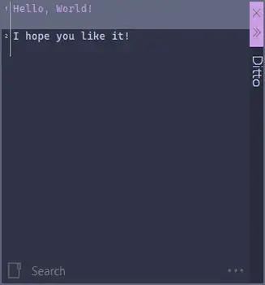
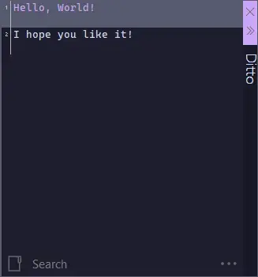

<h3 align="center">
  <br/>
  
  Catppuccin for <a href="https://ditto-cp.sourceforge.io/">Ditto</a>
  
</h3>

<p align="center">
  <a href="https://github.com/Villoh/ditto/stargazers"></a>
  <a href="https://github.com/Villoh/ditto/issues"></a>
  <a href="https://github.com/Villoh/ditto/contributors"></a>
</p>

<p align="center">
  
</p>

## Previews

<details>
<summary>🌻 Latte</summary>

</details>
<details>
<summary>🪴 Frappé</summary>

</details>
<details>
<summary>🌺 Macchiato</summary>

</details>
<details>
<summary>🌿 Mocha</summary>

</details>

## Usage

1. Download the [latest release](https://github.com/Villoh/ditto/releases/latest) or clone the repository:
   ```sh
   git clone https://github.com/Villoh/ditto.git
   ```
2. Copy or move the desired `*.xml` file(s) to the Ditto themes folder:
   - **Installed version:** `C:\Program Files\Ditto\Themes`
   - **Portable version:** `Themes\` folder inside your Ditto directory

### Activating the theme

1. Open Ditto by clicking its icon in the system tray or pressing the default hotkey <kbd>Ctrl</kbd>+<kbd>`</kbd>.
2. Click the menu icon **⋯** in the lower-right corner and select **Options**.
3. In the **General** tab, locate **Themes** and select your desired flavor.
4. Click **OK**.

## 💝 Thanks to

- [Villoh](https://github.com/Villoh)

&nbsp;

<p align="center"></p>
<p align="center">Copyright &copy; 2021-present <a href="https://github.com/catppuccin" target="_blank">Catppuccin Org</a>
<p align="center"><a href="https://github.com/catppuccin/catppuccin/blob/main/LICENSE"></a></p>
